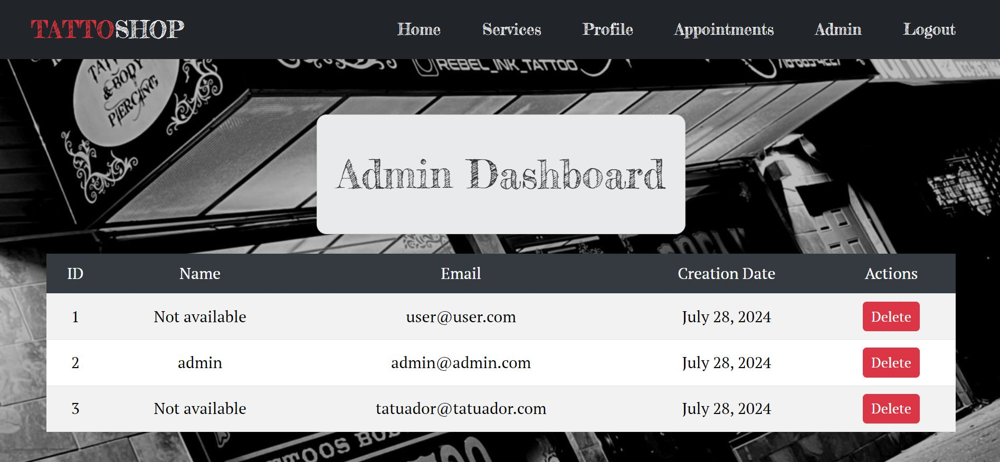

# TattooShop Frontend🖋️

Welcome to my TattooShop Frontend project, I hope you like it! 📈
<br><br>

</a>

<details>
  <summary>Table of Contents📝</summary>
  <ol>
 <li><a href="#description">Description</a></li>
    <li><a href="#objetive">Objetive</a></li>
    <li><a href="#stack">Stack</a></li>
    <li><a href="#local-installation">Local installation</a></li>
    <li><a href="#views">Views</a></li>
    <li><a href="#future-functionalities️">Future functionalities</a></li>
    <li><a href="#development">Development</a></li>
    <li><a href="#appreciations">Appreciations</a></li>
    <li><a href="#contact">Contact</a></li>
  </ol>
</details>
<br>

## Description📚
This project consists in the generation of the front end that connects to our API in charge of managing the business model of our tattoo studio.<br> To do this we will generate views that allow us to register and log in as users, view our user profile and modify it, as well as view our appointments. In addition, we will need to be able to see the services offered by the studio and to be able to make new appointments.<br> Finally, an administrator view from which you will be able to access the application information and modify it as appropriate.


## Objetive🎯
The objetive of this project is to create a front end of the app versatile enough for clients, professionals and an administrator to access and make use of it, for this I have been using React until I get a good command of the language.

## Stack📒
Used technology:
<div align="center">
<a>
    
</a>
<a>
    
</a>
<a>
    
</a>
<a>
    
</a>
<a>

</a>
<a>
    
</a>
</div>

## Local installation🧾
1. Clone the repository
2. ``` $ npm install  ```
3. ``` $ npm run dev ```


## Views🧩

home.


services.


login and register.


profile.


admin.



appointments.


## Future functionalities⏭️


## Development👨🏻‍💻

```js
const developer = "DavidFernandez";

console.log("Developed by: " DavidFernandez);
```

## Appreciations💯

I would like to dedicate my thanks to the teachers at Geeks Hubs as well as my day to day peers with whom we can help each other with our problems.


## Contact📲
- **David Fernandez Valle**
  - [GitHub](https://github.com/Davfernandezz)
  - [Linkedin](https://www.linkedin.com/in/david-fern%C3%A1ndez-valle-1b4461300/?originalSubdomain=es)
